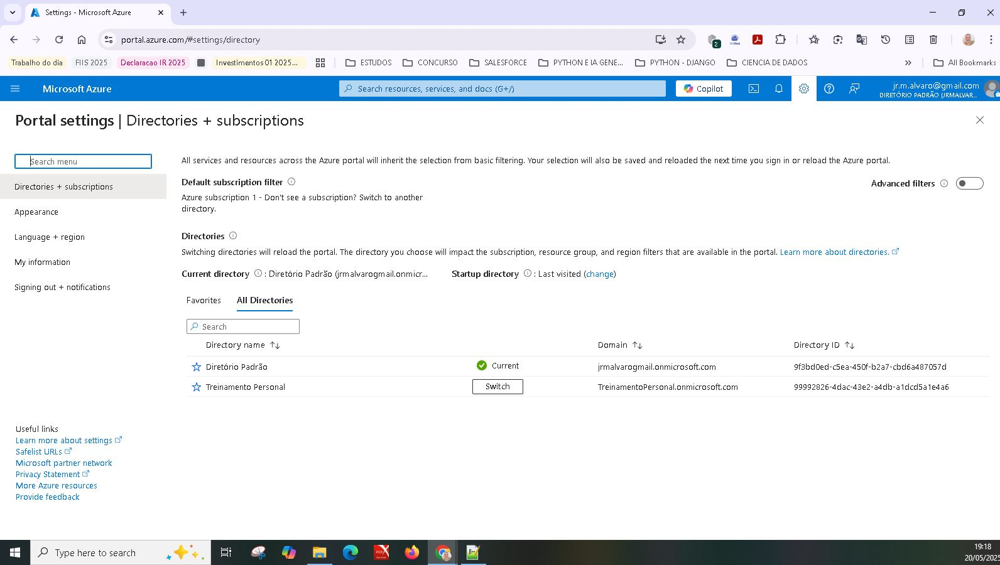
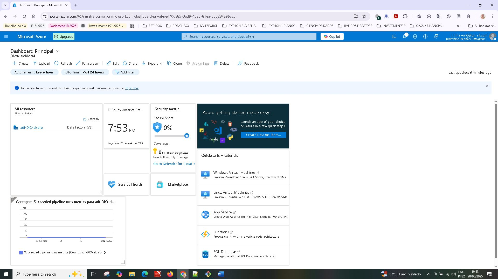

    

<h1> # DIO-Azure  </h1>

<h1>BootCamp : Azure Databricks </h1>

# Projeto : Criando um Monitoramento de Custos no Data Factory

 > **Objetivo:** Este é o repositório desenvolvido durante o curso BootCamp Azure Databricks na plataforma da [DIO](https://dio.me)

Projeto com o objetivo de gerar evidência do conhecimento absorvido no treinamento Monitoramento de Custos no Data Factory

## 💻 Tecnologias utilizadas no projeto

- [Github] 
- [Azure]

##    Desciption

Entendendo o Desafio
Agora é a sua hora de brilhar e construir um perfil de destaque na DIO! Explore todos os conceitos explorados até aqui e replique (ou melhore, porque não?) este projeto prático. Para isso, crie seu próprio repositório e aumente ainda mais seu portfólio de projetos no GitHub, o qual pode fazer toda diferença em suas entrevistas técnicas 😎

Como entregar esse projeto?
Chegou a hora de você construir um portfólio ainda mais rico e impressionar futuros recrutadores, para isso é sempre importante mostrar os resultados do seu esforço
e como você os obteve deixando claro o seu racional, para isso faça da seguinte maneira:

1. Crie um novo repositório no github com um nome a sua preferência
2. Crie um arquivo chamado readme.md;
3.    Deixe alguns prints ;
4.    Descreva o processo, alguns insights e possibilidades que você aprendeu durante o conteúdo;
5.    Após a IA analisar suas sentenças
6. Compartilhe conosco o link desse repositório através do botão 'entregar projeto'

 
## ✨ Solution

  1) Neste desafio navegamos de forma básica pela interface do Azure.
  2) Não usamos uma conta de estudande, usamos uma contra free por 30 dias.
  3) Veremos os prints de passo a passo da criação da conta e a criação de um recurso que no caso e o Data Fabric
  4) Alteramos o idioma para inglês durante o processo de criação de subscription (assinatura)
     Na imagem vemos 2 assinaturas, porém a selecionada e a Default.
     

       
     

  5) Na figura abaixo vemos o Dashboard Principal (Painel) customizado, com as seguintes features:
     Recurso: Data factory
              Horario local
              Metrica de Segurança
              Metrica de Contagem de Pipelines executados
      

       
      

  6) Agora vemos as features da criação do Data Factory

     Seguimos a boa pratica descrita em recomendações de abreviações
     <ref>https://learn.microsoft.com/pt-br/azure/cloud-adoption-framework/ready/azure-best-practices/resource-abbreviations</ref>
     
## 👨‍💻 Desenvolvedor/Aluno

    
&nbsp&nbsp&nbspAlvaro Monteiro 
    &nbsp&nbsp&nbsp
    <a href="https://github.com/Alvaro-MSJR">
    GitHub</a>&nbsp;|&nbsp;
    <a href="www.linkedin.com/in/alvaro-monteiro-silva">LinkedIn</a>
&nbsp;|&nbsp;

  

---
⌨️ conteúdo por [Alvaro Monteiro](https://github.com/Alvaro-MSJR)
